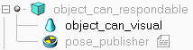

# <font size="7">Cogrob Manipulation Workspace</font>

[](https://opensource.org/licenses/MIT)

Extendable Action Task and Motion Planning System for Home-Mobile-Robot(Fetch)
## Description

The Cogrob home robot project on the Fetch robot provides an open-loop manipulation task and motion planner and all necessary packages for running and testing. The objective of this planner is to generate a feasible robot state trajectory based on a given simple task description, allowing the robot to manipulate a single graspable rigid object. Our system relies on certain assumptions, including that the target object must be within the camera view, and all manipulation must be feasible on the visible part of a supporing surface.

To facilitate the development and testing of the system, we offer a simulation platform based on Coppeliasim, and a Dockerfile to enable easy transfer of the workspace to developers' computers.

__Remind__: This is manipulation system is a open loop system. That is, once the planning scene is given, this TAMP system plans the robot trajectory to finish the desired task, then pass to the robot for exuection. That is, once the manipulation fails during execution, the system will fail directly, and there is no any module to detect the failure and replan. Besides that, the MoveIt! in our system is modified based on our need for constrained motion planning and deep learning, so you can't use the original Moveit with this system.

## System Structure
Basically, there are 6 components in our system, as shown in the following diagram. Currently, we only focus on the task planner, motion planner, and action database. For the rest of them, we assume it works well for now, and we may work on them in future.


### Pre-defined action library
Pre-defined action library is a map of task action(or API action) defined by developer where API action is mapped to a constraint set, such as [move horizontally] -> [horizontal constraint]. Furthermore, each constraint set composed constraints where each of them is represented by ref pose, in-hand pose, in-hand object bounding box, and tolerance.

### Task interpretor
Given a task description text, the task interpretor generates a API action sequence. For this section, the first possible method is using ChatGPT directly split the task description into a sequence of pre-defined action, and hopefully it works. Othersise, similar to CoMPNetX, we can use deep neural network-based iterative program predictor.

### Task planner
Based on the action sequence with object constraints and a set of grasping pose over the object, the task planner generates a foliation stucture to represent this action sequence and uses a MDP structure for re-planning.

### Motion planner
Basically, this motion planner will generate the actual arm motion for manipulation. Once the motion planner receives a task, containing start/target configurations and constraints, it will first pass them to the action database for seaching some similar experience. Then, based on the experience, this motin planner will plan for the trajectory.

### Action database
For each motion planning request, the motion planner will first pass the task to the action database and search for some experience if exists for improving efficiency. For this section, given the task from the motion planner, a deep learning based method will be used to generated a graph structure as a experience. 

### Robot controller
Given the robot state trajectory, the robot controller will directly execute the manipulation without close-loop mechanism. 

## Getting Started

### Dependencies

- Ubuntu 18.04
- ROS melodic (Because of Fetch Robot)
- Docker
- Nvidia Container toolkit

### Installing
Because we will use CoppeliaSim as our simulation and some other third app for this project, we need to download the zip file from [here](https://drive.google.com/drive/folders/1QUWJlT4B2yIQaNmF-G1xE8XvtskaKTv8?usp=sharing). Then, place them in (__do not unzip them__)
```
[directory where you have the jiaming_manipulation]/jiaming_manipulation/docker_image/download
```
Build the docker image, and this step will take a long time.
```
cd [directory where you have the jiaming_manipulation]/jiaming_manipulation/docker_image
sh build.sh
```

Once the image is built, you can run the image as a container by (__xhost is required once you use docker run here__)
```
xhost +
sh run.sh
```

At this point, you will enter the container, but the workspace is not compiled yet. In the docker container, you need to run following code for preparing the workspace.

<a id="workspace_prepare"></a>
```
cd $HOME
./prepare_workspace.sh
source .bashrc
```

If you want to run multiple terminals in the container after running above commands, you can run the following commands in a new terminal(__not in the container__)
```
cd [directory where you have the jiaming_manipulation]/jiaming_manipulation/docker_image && sh enter_lastest_container.sh
```
For runing this command properly, you can have only one active container.

## Usage

### __*Use Jupyter notebook*__
Your are allowed to use jupyter notebook with the following command
```
jupyter notebook --allow-root
```

### __*Preparing the trajectory dataset*__
In this project, we will use deep learning based method to generate the trajectory for planning, so we need to generate a collision-free trajectory database for Fetch. In this case, we do not need to have real robot or simulated robot to launch Moveit, and we can use a fake robot to launch Moveit instead.

```
roslaunch fetch_moveit_config data_generation_with_move_group.launch
rosrun data_generation trajectory_generation.py
```

This command will create a 'trajectory_data' directory with the trajectories at where you run this command. The format of this directory should be like the following
```
env_000001
    -   map_1.ply
    -   path_0.p
    -   path_1.p
        .
        .
env_000002
    -   map_2.ply
    -   path_0.p
    -   path_1.p
        .
        . 
```
where each map_i.ply is the full pointcloud of obstavles in the env i, while each path_j.p in env_i is the path generated by RRT* between two random feasbile points in env_i.

### Add new manipulated object in Sim
In this project, when you want to use some object in the simulation, you need to provide both collision mesh (better to be simple) and visual mesh. After you import both of them in the simulation, you need to set the visual mesh as a child of the collision mesh and set the collision mesh as the model. For example, you have "can" object, and you need to name both meshes as "object_can_respondable" and "object_can_visual" respectively. By the way, you need to overlap them in simulation. For easily accessing its pose later, you need to have a pose publisher for each desired object to publish its tranform into the tf tree. To do that, you need to create a dummy node with a [child script](notes/pose_publisher.txt) as another child of the collision mesh. The final hieracrchy structure of the object is shown as below



In this project, we have a fake object segmentation in simulation. The segmentation result will be published in topic **"/head_camera/seg/image_rect_color"**, while the list of pair (segmentation color and name) is in the topic **"/segmented_object_list/objects"**.

Moreover, to get the color of each object quickly, you can run in terminal with the following command
```
rostopic echo -n 1 /segmented_object_list/objects | grep -E 'name|rgb' | awk 'NR%2==0 {print p,$0} {p=$0}'
```

### Sim manipulation helper
Sim manipulation helper is a python3 pacakge for manipulating models in the simulation. For example, "resetScene" can be used to reset the robot state. For more detail, you can check the [sim_manipulation_helper.py](fetch_coppeliasim/scripts/sim_manipulation_helper.py) for more function. To use this package, you need to include the following code in the top of file
```
import rospy
import rospkg
import sys

sys.path.insert(0, rospkg.RosPack().get_path('fetch_coppeliasim') + '/scripts')
from sim_manipulation_helper import SimManipulationHelper
```

In this package, it will send the action command to ros controller for seting robot state in the simulation, so "rospy.init_node" must be called. Then you can create a helper object and manipulate the scene like following
```
rospy.init_node('Sim_manipulation_helper_example')
s_m_helper = SimManipulationHelper()
s_m_helper.resetScene()
```

### Launch the simulation and ROS controller
Before to launch the simulation and the ROS controller of the robot in simulation, you need to ensure that you have [parpared the workspace](#workspace_prepare). Then, you can run following command in two different terminals in order
```
roslaunch fetch_coppeliasim simulation.launch
roslaunch fetch_coppeliasim fetch_control.launch
```

<span style="color: red">Warning: sometimes Coppeliasim will ask you to update the coppeliasim, please close it quick, or it will cause some error in fetch_control.launch.</span>

### Run ros node in conda
In this project, we have ros server to use contact grasp net for grasp prediction which is running in a specific conda env. You can run it with the following command.
```
conda run -n contact_graspnet_env --no-capture-output rosrun ros_tensorflow grasp_prediction_server.py
```

For the computer with 30-series machines, we have to use different conda env to launch the server
```
conda run -n contact_graspnet_30 --no-capture-output rosrun ros_tensorflow grasp_prediction_server.py
```
<!-- 
### Use the blender to render the scene
In this project, we provide the solution to use Blender as the rendering engine for better photorealistic rendering. The basic idea here is you need to prepare a blend file which is exactly similar to the scene used in the Coppeliasim, and save it in fetch_coppeliasim/scene. Thus, you can enter the fetch_coppeliasim/scene directory and run the following command after launching simulation and controller.

```
./launch_blender_cam.sh /path/to/blend.file
```

In this code, it first updates the camera in blender based on the transform of the camera in tf tree, then render and publish the camera image to the topic __'/blender_camera/image_raw'__. Thus, there will be only scene, so this is most likely used by navigation. In future, you can update the code to include the manipulated object and update their poses based on the tf tree as well. -->

### Testing
<span style="color: red">TODO</span>

## Contributing

As mentioned above, all manipulation developer can include their action into this system by building a ROS action server and include the customized action into task planner. Please keep in mind, the action server must follow certain template which we have put some example in this repo.

## Future Work

Our current manipulation system operates as an open-loop system, but we plan to convert it into a semi-closed loop system in the future. This means that the task planner will use the outcome of previous manipulations to make informed decisions about the next task action. If an action fails, the task planner will automatically replan the action sequence based on the current state. We face a challenge in this process, as the failure state may be unexpected. To address this, we will regenerate a Markov Decision Process structure action graph for the failure state. We hope to reuse the previous MDP structure action graph to improve efficiency and achieve better results in real-world scenarios.
## Authors

- Jiaming Hu


## License

Include information about the license for your project, along with any restrictions or requirements that come with it.

## Acknowledgments

If your project was built using someone else's work, give credit to the original author and provide a link to their work. You can also use this section to thank anyone who helped you with your project.

predicted_grasp_poses: 
  - 
    header: 
      seq: 0
      stamp: 
        secs: 0
        nsecs:         0
      frame_id: "base_link"
    pose: 
      position: 
        x: 1.88977508651
        y: 1.93812029984
        z: 2.16230552903
      orientation: 
        x: -0.246540134256
        y: 0.680135133783
        z: 0.636264791092
        w: 0.267957604133
  - 
    header: 
      seq: 0
      stamp: 
        secs: 0
        nsecs:         0
      frame_id: "base_link"
    pose: 
      position: 
        x: 1.61764755961
        y: 2.09899962006
        z: 1.84668261341
      orientation: 
        x: -0.25345032488
        y: 0.663945974008
        z: 0.655572919675
        w: 0.255270098925
  - 

  import rospy
from visualization_msgs.msg import Marker, MarkerArray
from std_msgs.msg import Header, ColorRGBA
from geometry_msgs.msg import Vector3

# 初始化ROS节点
rospy.init_node('grasp_markers_visualization')

# 创建一个MarkerArray类型的Publisher
marker_array_publisher = rospy.Publisher('/grasp_markers', MarkerArray, queue_size=10)

def publish_markers(predict_response):
    marker_array_msg = MarkerArray()

    # 逐个将PredictResponse中的位姿转换为Marker消息
    for i, grasp_pose in enumerate(predict_response.predicted_grasp_poses):
        marker_msg = Marker()
        marker_msg.header.frame_id = grasp_pose.header.frame_id or "base_link"
        marker_msg.header.stamp = rospy.Time.now()
        marker_msg.ns = "grasp_poses"
        marker_msg.id = i
        marker_msg.type = Marker.ARROW
        marker_msg.action = Marker.ADD
        marker_msg.pose = grasp_pose.pose
        
        # 设置箭头尺寸：(length, width, height)
        marker_msg.scale = Vector3(0.1, 0.02, 0.02)  # 小一点的箭头
        
        # 设置箭头颜色：(r, g, b, a)
        marker_msg.color = ColorRGBA(0.0, 1.0, 0.0, 1.0)  # 绿色箭头
        
        # 设置箭头的生命周期，0表示永久
        marker_msg.lifetime = rospy.Duration(0)
        
        marker_array_msg.markers.append(marker_msg)
    
    # 发布MarkerArray消息
    marker_array_publisher.publish(marker_array_msg)
    rospy.loginfo("Published grasp markers to /grasp_markers")

should_continue = True

def filter_point_cloud_by_color(point_cloud_data, color, point_step):
    filtered_points = []
    for p in pc2.read_points(point_cloud_data, field_names=("x", "y", "z", "rgb"), skip_nans=True):
        _, _, _, rgb = p
        int_rgb = struct.unpack('I', struct.pack('f', rgb))[0]
        r = (int_rgb >> 16) & 0xFF
        g = (int_rgb >> 8) & 0xFF
        b = int_rgb & 0xFF

        if (r, g, b) == color or (r == g == b == 0):
            filtered_points.append(p)

    header = point_cloud_data.header
    filtered_pc2 = msgify(PointCloud2, np.array(filtered_points, dtype=[
        ('x', np.float32),
        ('y', np.float32),
        ('z', np.float32),
        ('rgb', np.float32)
    ]), stamp=header.stamp, frame_id=header.frame_id)

    return filtered_pc2

def get_color_from_point(point, is_bigendian):
    color_data = int(point[-1][-1])

    if is_bigendian:
        # Big endian
        r = (color_data >> 24) & 0xFF
        g = (color_data >> 16) & 0xFF
        b = (color_data >> 8) & 0xFF
    else:
        # Little endian
        r = color_data & 0xFF
        g = (color_data >> 8) & 0xFF
        b = (color_data >> 16) & 0xFF

    return (r, g, b)

def parse_points(data, point_step):
    points = []
    for i in range(0, len(data), point_step):
        point_data = data[i:i+point_step]
        x, y, z = struct.unpack_from('fff', point_data, 0)

        rgba = struct.unpack_from('I', point_data, 16)[0]
        r = (rgba >> 16) & 0xFF
        g = (rgba >> 8) & 0xFF
        b = rgba & 0xFF
        a = (rgba >> 24) & 0xFF 
        points.append((x, y, z, r, g, b, a))  
    return points

def callback(point_cloud_data):
    global should_continue
    pc_arr = numpify(point_cloud_data)
    is_bigendian = point_cloud_data.is_bigendian
    point_step = point_cloud_data.point_step
    row_step = point_cloud_data.row_step
    id_dense = point_cloud_data.is_dense
    print("is_bigendian", is_bigendian, "point_step", point_step, "row_step", row_step, "id_dense", id_dense)
    data = point_cloud_data.data
    points = parse_points(data, point_step)
    manager.reset()

    color_to_filtered_points = {}

    color_to_filtered_points[(0, 0, 0)] = []

    for point in points:
        x, y, z, r, g, b, a = point
        color_key = (r, g, b)

        if color_key not in color_to_filtered_points:
            color_to_filtered_points[color_key] = []
        color_to_filtered_points[color_key].append((x, y, z, r, g, b, a))


    for color, color_points in color_to_filtered_points.items():

        if color != (0, 0, 0):
            filtered_pc2 = filter_point_cloud_by_color(point_cloud_data, color, point_step)
        else:
            filtered_pc2 = point_cloud_data

        for p in color_points:
            x, y, z, r, g, b, a = p
            manager.add_item(r, g, b, (x, y, z), filtered_pc2)

    should_continue = False
    subscriber.unregister()

def listener():
    global subscriber
    global should_continue
    print("Listening...")
    rospy.init_node('point_cloud_listener', anonymous=True)
    subscriber = rospy.Subscriber('/head_camera/depth_seg/points', PointCloud2, callback)
    rate = rospy.Rate(1)
    while should_continue:
        break;
        rate.sleep()