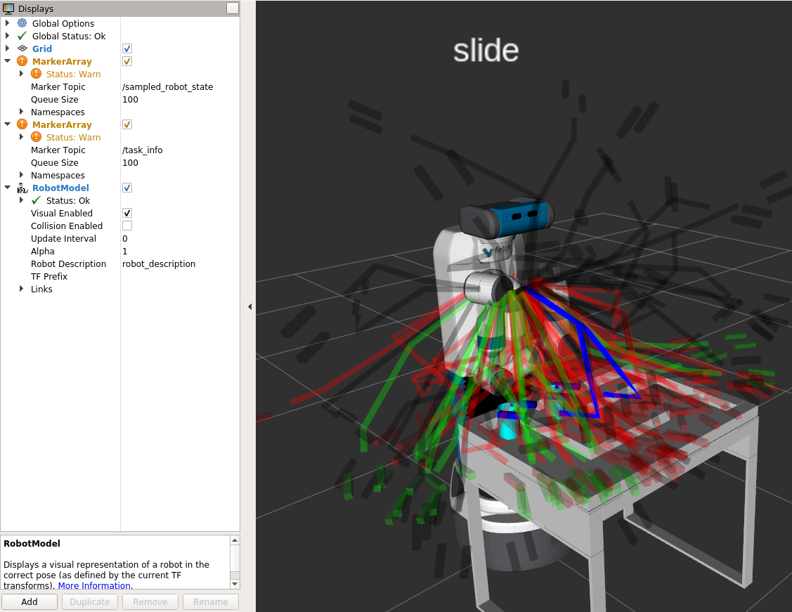

<h1>Experience-based Task and Motion Planning Framework for Foliated Manifolds</h>

# Motivation

The objective of this project is to leverage both atlas and Gaussian Mixture Models (GMM) to model the folied manifolds to enhance the performance of task and motion planning in foliated structure problem. In traditional task and motion planning, a two-level planner is commonly employed. Initially, the task planner devises a sequence of tasks, while the subsequent motion planner determines the motion plan for each task in the sequence. Prominent methods such as MTG (Informing Multi-Modal Planning with Synergistic Discrete Leads) and MDP (Multi-Modal Planning on Regrasping for Stable Manipulation) are widely used. Basically, both of them are following the idea of generating a new task sequence which is different from previous failure. However, these methods do not effectively reuse prior planning experiences comming from the motion planner. In this work, we propose a novel framework that leverages the prior planning experiences to model the foliated manifolds more precisely. Therefore, the task planner can generate a more feasible task sequence which contains more information to guide the motion planner.

# Table of Contents
- [Motivation](#motivation)
- [Table of Contents](#table-of-contents)
- [Preivous Works](#preivous-works)
- [Methodology](#methodology)
- [Experimental Goals](#experimental-goals)
- [Foliated planning framework tutorial](#foliated-planning-framework-tutorial)
- [Nautilus tutorial](#nautilus-tutorial)
- [Usage](#usage)
  - [Base tutorial](#base-tutorial)
  - [Visualization tutorial](#visualization-tutorial)
  - [Evaluation tutorial](#evaluation-tutorial)
  - [Experience generation tutorial](#experience-generation-tutorial)
- [Other tutorial](#other-tutorial)

# Preivous Works
We have submitted a paper to ICEA 2024(under reviewed) for previous work, here is the [link](https://arxiv.org/pdf/2310.08494.pdf). In this work, we mainly use GMM based Repetitional Roadmap alone to model the foliated manifodls. However, in some cases, when the problem's constrained manifolds' volume are very thin, the previous work will not performace well anymore. <b>Please read this paper if you can!</b> Based on the previous work, we can see the roadmap with MTG is more robust and faster than the roadmap without MDP. Therefore, in this project, we will use only MTG as our task planner.

# Methodology
Baseically, this platform contains two-level planners.

<h2>Task Planner</h2>
Compared to the previous work using only Repetitional Roadmap for the task planner, we will use both Repetitional Roadmap and Atlas here. That is, our task planner contains two level structure to model the foliated manifolds. The first level is to use Repetitional Roadmap as globally guidance, while the second level is to use Atlas as locally guidance.

The modification here is that for each repetitional roadmap's node, we will store the atlas information in it. That is, this atlas will model the local region around this node. Once the task planner returns a task sequence, we will use the atlas information to guide the motion planner instead of using Gaussian Distribution only. One important thing here is that we do not discard the Gaussian Distribution completely. We will still use it when the volume of the constrained manifolds is not thin.


Therefore, each roadmap node should contain following informations:

1. <b>Atlas information</b>: A set of tangent polytopes convers the local region around this node.
2. <b>Gaussion distribution</b>: A distribution to represent the local region around this node. It is used when the volume of the constrained manifolds is not thin. 
3. <b>Collision weight</b>: A scalar value to represent the collision probability of this node. If the value is higher, then the collision probability is higher. Range from 0 to infinity.
4. <b>Constraint violation weight</b>: A scalar value to represent the constraint violation probability of this node. If the value is higher, then the constraint violation probability is higher. Range from 0 to infinity.
5. <b>Atlas-Distribution ratio</b>: A ratio to represent the ratio of atlas and distribution. If the value is higher, then the atlas will be more important. Range from 0 to 1.

The main research here is that, how we should update both <b>Atlas information</b> and <b>Atlas-Distribution ratio</b> based on the previous planning experience.

<b>pipeline</b>

After motion planning in manifold defined by foliation _f_ and co-parameter _θ_, the motion planner returns a set of sampled configurations. The task planner will used them to update the roadmap in the **update** function. The pipeline is as follows:
1. For each configuration, the task planner will find which distribution _d_ it belongs to.
2. For each node defined by _f_, _θ_, and _d_, the task planner will find all the sampled **valid** configurations belong to it, and then update the atlas information by calling a ros call "construct_atlas". For more details, please check moveit_cbirrt/moveit/moveit_planners/ompl/ompl_interface/src/experience_manager.cpp. In the function "constructAtlasOfRoadmapService", for ecah node and its related sampled configurations, we use **getChart()** of **AtlasStateSpace** to construct a Atlas. If there is no atlas yet, the **AtlasStateSpace** will be constructed first.
3. Based on those sampled configurations with status, the task planner will update the weight of each node in the roadmap based on the similarity table. 
4. Eventually, for each node, the task planner increase the counters about the configuration number of valid configurations and invalid configurations before project.Those values can then be used to calculate the atlas-distribution ratio.

Then the task planner will use the roadmap to generate a task sequence in **generate_task_sequence** function. The pipeline is as follows:

1.  Based on the roadmap's weight, task planner will generate a task sequence via Dijkstra algorithm.
2. For each node (_f_, _θ_, _d_) in the task sequence, the function **get_related_task_nodes** will find all the nodes (_f_, _θ'_, _d_), if it contains an Atlas, in the roadmap where _θ'_ is the other co-parameters in the foliation _f_, include itself if it has atlas. Then, each node has a related score _r_, which is multiplication bewteen the atlas-distribution ratio of (_f_, _θ'_, _d_) and the similarity score bewteen (_f_, _θ_, _d_) and (_f_, _θ'_, _d_). Therefore, each node of the result node sequence contains a related nodes with score such as [(_f<sub>1</sub>_, _θ<sub>1</sub>_, _d<sub>1</sub>_, _r<sub>1</sub>_), (_f<sub>2</sub>_, _θ<sub>2</sub>_, _d<sub>2</sub>_, _r<sub>2</sub>_), ...]. However, sometimes, a node may contain Atlas but without any sampled configurations before project. In this case, we consider its atlas-distribution ratio as 1.0.
3. The task planner will find the corresponding atlass and combine them by calling function **extract_atlas**(moveit_cbirrt/moveit/moveit_planners/ompl/ompl_interface/src
/experience_manager.cpp). This function will receive all the related nodes with score such as (_f<sub>i</sub>_, _θ<sub>i</sub>_, _d<sub>i</sub>_, _r<sub>i</sub>_), and find the atlas _α<sub>i</sub>_ of this node from large to small. Then combine them in order by adding each Chart's origin point from _α<sub>i</sub>_ with weight _r<sub>i</sub>_ to a result atlas _α<sub>result</sub>_. Therefore, the atlas _α_ with large _r_ will be added first, and cover the atlas _α_ with small _r_. Then the atlas-distribution-ratio will be the average of all the _r_. We will not add the atlas with _r_ less than 0.1(you can set any value you want).

<h2> Motion Planner</h2>
We will develop CDistributionAtlasRRT as our motion planner. But this planner can read the atlas information, Gaussion Distribution, and atlas-distribution ratio to guide the planning process. The main research here is that, how we should combine those three information to guide the planning process.

In https://github.com/jih189/moveit_cbirrt/blob/c75c9e723a1deae95359096466f619c06d39f6db/constrained_ompl_planners/src/CDistributionrrt.cpp, the **solve** function will be called to solve the planning problem. The following code it the C++ code to sample a configuration(sample_value) based on all ratio.

```
if(gaussian_distributions_.size() != 0 && ((double) rand() / (RAND_MAX)) < sample_ratio_)
{
    sample_value = ((double) rand() / (RAND_MAX)) >= atlas_distribution_ratio_ ? 
                            sample_from_distribution_sequence(gaussian_distributions_, dist, gen) : sample_from_atlas();
}
else
{
    sample_value = sample_from_random();
}

```
sample_ratio_ is the ratio about sampling randomly or from distribution/Atlas. If the vaule is high, then the motion planner will sample more from distribution/Atlas.

atlas_distribution_ratio_ is the ratio about sampling from Atlas or distribution. If the value is high, then the motion planner will sample more from Atlas.

After, the sampling process, the motion planner will first check its status and save it. If the sampled configuration is not on the manifold, the motion planner will project the sampled configuration to the constrained manifolds and check its state and save. This process will be repeated until the sampled configuration is on the manifold.


<h2> Dynamic Roadmap</h2>
TODO

# Experimental Goals
In this project, we will compare the following methods in different setup:
1. MTG
2. MTG with Repetitional Roadmap
3. MTG with both Repetitional Roadmap as globally and Atlas as locally.
4. MTG with Repetiaional Roadmap generated by Deep Learning(Optional)

# Foliated planning framework tutorial

The tutorial is in here [foliated manifold framework setup](readme_files/foliation_setup_tutorial.md)

Here is the tutorial about how to implement your own task planner and motion planner [task and motion planner tutorial](readme_files/task_and_motion_planner_tutorial.md)

# Nautilus tutorial
Nautilus provides a powerful platform with a lot of resources for us to run training and testing. The tutorial link is [here](readme_files/nautilus_tutorial.md).

<!-- ## Experiments

Here is the list of experiment we will have for this project:

1. pick-and-place with constraint
2. pick-and-place with constraint and regrasping
3. Sliding and regrasping(IROS 2023)
4. Sliding in simple maze

Each experiment here will be saved as a file in directory [experiment_dir](experiment_dir) so later we can load them for testing. Thus, you may need to read the comment in the file to understand how to save and load them. To create the experiment file, you can use the following code:
```
rosrun task_planner create_experiment_[experiment-name].py
``` -->

# Usage

## Base tutorial

In this project, we do not need to run on the real robot, so we can run the move_group in only simulation. Here is the code to launch fake move_group.

```
roslaunch fetch_moveit_config fake_move_group.launch
```

Then you need to provide your own code to generate folited problem, and then a code to load the problem and solve it with our planning framework. Here are the examples to do that, such <b>created_foliated_problem.py</b> and <b>load_foliated_problem_to_planner.py</b>. Then, run following code to generate the problem.
  
```
rosrun task_planner create_foliated_problem.py
```

Then, run following code to load the problem and solve it with our planning framework.

```
rosrun task_planner load_foliated_problem_to_planner.py
```

## Visualization tutorial

In case you want to visualize the task and sampling data, you can add two MarkerArray makers named "/sampled_robot_state" and "task_info" in Rviz. The final result should be RobotState named "move_group/result_display_robot_state", and Rviz should display the solution trajectory as anime. The current action name will be displayed on the upper side of the robot, while all the sampled configurtions will be displayed. Basically, there are five kinds of configuration displayed in the Rviz.

1. <b>Black configuration</b>: invalid configuration which is sampled without projection.
2. <b>withe configuration</b>: valid configuration which is sampled without projection.
3. <b>Red configuration</b>: invalid configuration which is sampled with projection.
4. <b>Green configuration</b>: valid configuration which is sampled with projection.
5. <b>Blue configuration</b>: the start and goal configurations of the current task.



## Experience generation tutorial
TODO

## Evaluation tutorial
TODO
<!-- We also provide the code to evaluate different task planner. 
```
rosrun task_planner evaluation.py
``` 

This code will first load the experiment file in experiment_dir, then evaluate the performance of each task planner. The evaluation result will be saved in the directory jiaming_manipulation/taskplanner/evaluated_data_dir. You should modify the parameter in the file to change the experiment you want to evaluate and the task planner you want to use. After evaluation, you can visualize them with the following code
```
rosrun task_planner visualize_result.py
```
-->

# Other tutorial
There section contains other tutorials or notes for this project. They are put here for internal use only.

1. [Motion planning tutorial](readme_files/motion_planning_tutorial.md)
2. [Data generation tutorial](readme_files/Data_generation_tutorial.md)